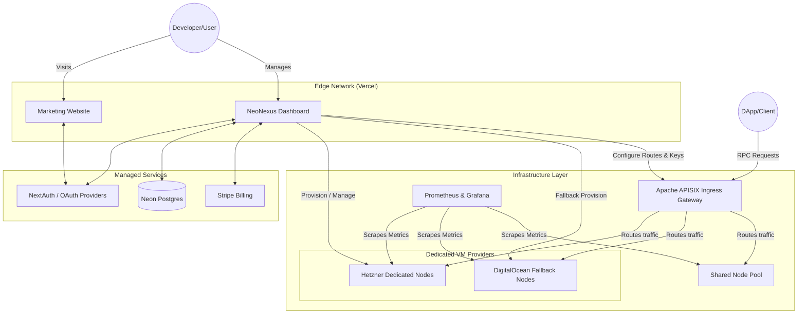

# NeoNexus Deployment Architecture

This document describes the recommended production architecture for deploying NeoNexus.

To achieve strong operational boundaries, NeoNexus is designed to be deployed across two separate environments: **The Frontend Edge (Vercel or a management VM)** and **The Backend Provisioning Plane (Hetzner VMs as primary, DigitalOcean VMs as fallback, with APISIX in front of both dedicated and shared node traffic)**.

## High-Level Architecture Diagram

## Why this Architecture?

1. **Separation of Concerns:** The Next.js frontend (Dashboard) handles the UI, authentication, database persistence, and billing. It can run on Vercel or another management environment while the provisioning plane stays isolated.
2. **Dedicated Nodes on VMs:** Dedicated blockchain nodes are provisioned as isolated VMs, which maps better to provider snapshots, fixed-IP routing, and per-customer operational ownership.
3. **API Gateway (APISIX):** Directly exposing provider VMs is dangerous. APISIX acts as the shield, validating API keys, enforcing rate limits, and routing traffic to the correct dedicated VM or shared upstream.
4. **Optional Shared-Service Cluster:** Kubernetes is optional and only relevant when you want to run APISIX, Prometheus, or related shared services on a small control-plane cluster.

## Setup Requirements

Before you begin the deployment process, ensure you have accounts and access to the following:

- **Vercel Account:** For hosting the `website` and `dashboard` Next.js applications.
- **Neon Account:** For the Serverless PostgreSQL database.
- **GitHub/Google Developer Console:** For OAuth credentials.
- **Stripe Account:** For handling subscriptions and payments.
- **Cloud Provider:** Hetzner for the primary dedicated-node footprint, with DigitalOcean retained as the backup deployment target.
- **Domain Name:** To configure DNS records (e.g., `neonexus.cloud`).
